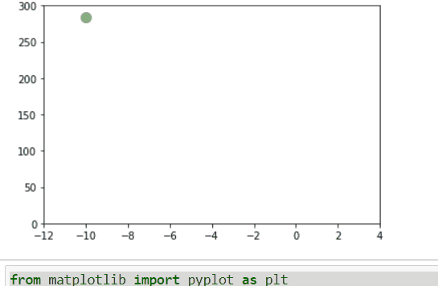

# fmuOptimization  

Find optimum solution of functional mock up unit using SciPy library.  

Optimization functions SciPy are used for minimizing (or maximizing) objective functions, possibly subject to constraints. In most of the examples, the functions are visible to SciPy as shown in simpleOptimization notebook. However functinal muck-up units (fmus) are compiled models therefore SciPy will not have visibility to the mathematical functions in the fmu.   
If the functions in SciPy perform some type of symbolic differentiation, that is not possible if the function to optimize is in fmu format.   
Therefore this test is to confirm if the SciPy optimization works with black-box functions like fmus.  

Modelica is an object-oriented language for modeling of physical systems. These models can be exported in the form of functional mock-up units (fmus). Co-simulation FMUs are standalone, tool agnostic model format. Therefore once the model is developed in Modelica, its fmu can be used in other tools/platforms. In Python there are multiple libraries that enable simulating fmus. Here FMPy is used to simulate the fmu.  

The primary goal of this test is to confirm SciPy can be used with fmus to find the optimum solution. Therefore here a simple quadratic function is written in Modelica and exported as fmu. In the result the minimize function from SciPy finds out the minimum value of the function.  

Next step is to use a convex physical system model instead of a simple quadratic function and find the optimum solution. 
